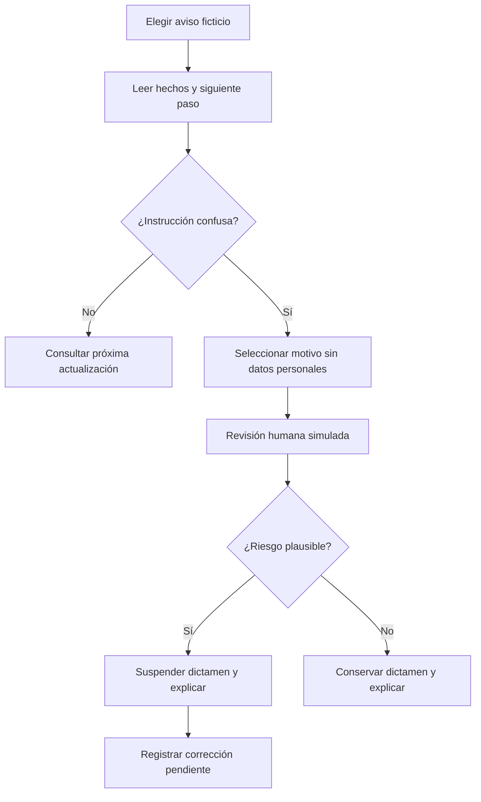
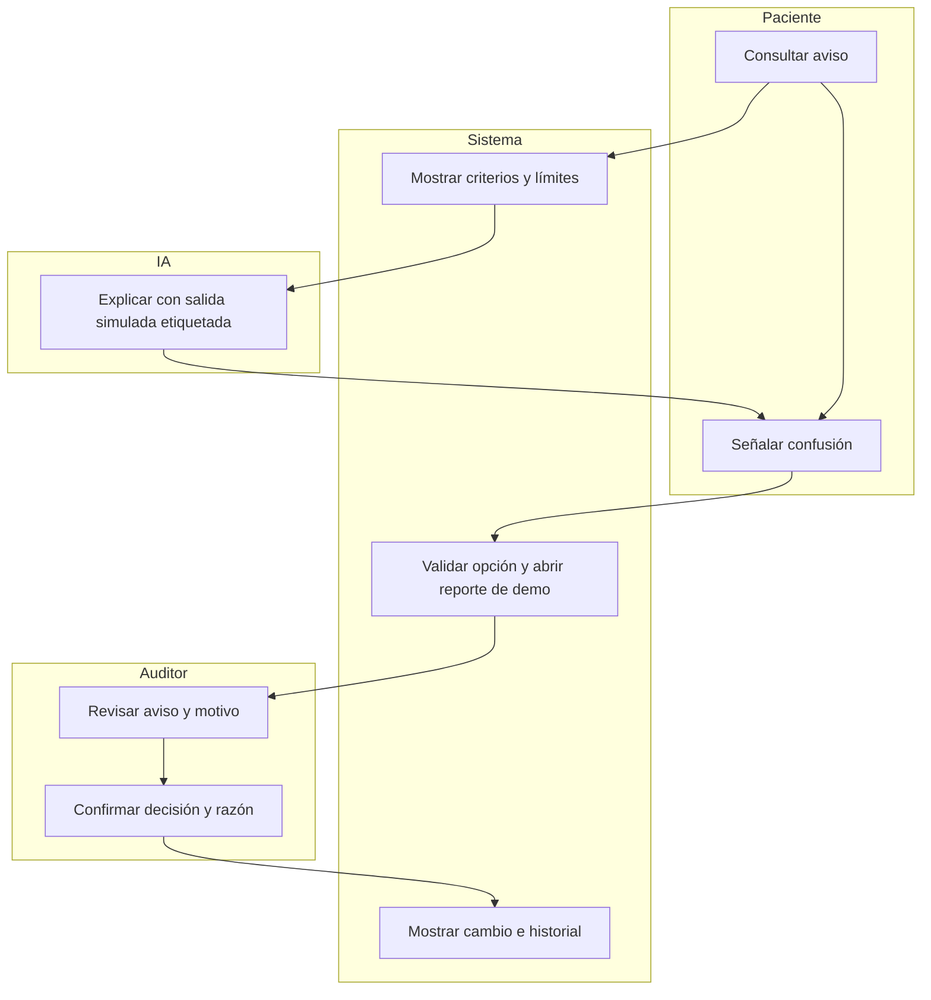

# Aviso Claro — Week 8
Isabella Zevada · Packet previo al código · 3 octubre 2026

Estado: borrador basado en BRIEF 08_IsabellaZevada.pdf. Falta cotejar el Blueprint final y su shadow clause. No hay implementación, pruebas ni despliegues realizados todavía.

## Problema en mis palabras
Recibir un aviso de filtración no sirve de mucho si no entiendo qué pasó ni qué tengo que hacer. Quiero probar una herramienta que muestre una evaluación limitada del aviso, sus incertidumbres y sus correcciones, sin convertirla en una promesa de que la clínica es segura.

## Usuario exacto
Laura, persona sintética de 54 años, paciente de una clínica en CDMX. Usa WhatsApp en Android, lee lentamente y recibe un aviso sobre un incidente de datos. Quiere entender qué debe hacer y teme que compartir información para pedir ayuda la exponga más. Esta persona es una hipótesis de diseño; no una entrevista real.

## Definición de éxito
Antes de cerrar el módulo, Laura puede abrir un caso ficticio en una URL pública, identificar qué se sabe, qué sigue incierto, el siguiente paso y la próxima actualización. Puede ensayar un reporte de ambigüedad y ver cómo un auditor simulado revisa el reporte y suspende un dictamen con razón visible. El prototipo no recibe denuncias reales ni contacta clínicas.

## Slice
1. Registro público de tres avisos ficticios con dictamen, criterios y correcciones.
2. Detalle con cuatro bloques: qué ocurrió, qué datos podrían estar afectados, qué hacer, próxima actualización.
3. Explicación sencilla del aviso mediante una salida LLM simulada y etiquetada; conserva incertidumbres y no cambia instrucciones aprobadas.
4. Reporte por opciones cerradas sobre un aviso ficticio; sin texto libre ni archivos personales.
5. Vista de auditor de demostración: un reporte no suspende automáticamente; el auditor verifica plausibilidad y confirma una transición con motivo. Todo permanece en memoria y se reinicia al recargar.

## Mockup generado con IA
Mockup conceptual solicitado mediante generación de imágenes en esta conversación. Debe mostrar la etiqueta de demostración, estado del dictamen, acción y botón de reporte. No constituye una captura de la aplicación ni prueba de funcionamiento. Incorporación al PDF final pendiente.

## Flujo

## Swimlane

## Benchmark
Mi referente global elegido es la guía Data Breach Response de la FTC, complementada por IdentityTheft.gov para planes personalizados de recuperación; no afirmo haber demostrado que sea la mejor solución entre todas las existentes.
Mi propuesta localiza la comunicación en español para pacientes de clínicas mexicanas y añade un registro de evaluación humana, correcciones y suspensión del dictamen ante ambigüedad plausible.
Fuentes: https://www.ftc.gov/business-guidance/resources/data-breach-response-guide-business y https://www.identitytheft.gov/Steps (consultadas el 3 octubre 2026). La referencia estadounidense orienta diseño, no establece obligaciones mexicanas.

## Visión a tres años
Si funciona, Aviso Claro se convierte en un registro independiente de evaluaciones de avisos para clínicas participantes en México. Una asociación financia un fondo común, pero no puede escoger al auditor, cambiar hallazgos ni ocultar evaluaciones desfavorables. El producto mide envío, entrega y comprensión por separado, publica límites y correcciones y evita almacenar expedientes de pacientes.

## Condiciones del brief individual
- La clínica no espera al auditor para emitir su primer aviso.
- Se publican todos los dictámenes del periodo; no existe sello de empresa segura.
- Falta de evidencia temporal: oportunidad no verificable; fechas contradictorias sin explicación: reprobado.
- Enviado, entregado y comprendido son métricas distintas; desconocido nunca equivale a cero ni a éxito.
- Corrección de omisión material dentro de 24 horas; registrar pendiente si no se corrige.
- Suspensión por un auditor ante reporte plausible; no exigir daño bancario probado.
- Prueba futura de claridad con diez personas: dos sin entender la acción o una que interpreta esperar ante riesgo urgente hacen fallar el aviso. La prueba sintética académica no demuestra ese umbral con personas reales.
- No publicar nombres de pacientes, expedientes, contactos ni rutas técnicas.
- Detener expansión ante demora del primer aviso, influencia del pagador o instrucciones peligrosas aprobadas.

## Blueprint y shadow clause
PENDIENTE: insertar y mapear las condiciones exactas del Blueprint final del equipo antes de comenzar código. Riesgo identificado en el brief individual: una evaluación puede crear falsa confianza o amplificar daño al exponer información sensible. Barreras propuestas: dictamen limitado, incertidumbre visible, revisión humana, suspensión motivada y datos ficticios. Esto no reemplaza la shadow clause del equipo.

## Alcance excluido
No antivirus, gestor de contraseñas, detección de filtraciones, asesoría clínica, sello de cumplimiento legal, denuncias reales, contactos de pacientes, expedientes, notificaciones automáticas ni producción multiusuario. La vista de auditor es una simulación pública sin autoridad real.

## Arquitectura y stack propuesto
| Capa | Tecnología | Función y límite |
|---|---|---|
| LLM | Adaptador con respuestas predefinidas, SIMULADO | Explicación de casos ficticios; no es una llamada real a modelo. Confirmar que esta modalidad cumple el piso del curso antes del build. |
| Seguridad | DOMPurify y política CSP | Sanitización de contenido renderizado y restricción de recursos; no detecta filtraciones. |
| Tercer componente | JSON estructurado de incidentes ficticios | Fechas, categorías, evidencia disponible, dictámenes y correcciones. |
| Interfaz | HTML/CSS/JavaScript accesible | Consulta móvil y flujo de revisión de demo. |
| Estado | Memoria del navegador | Sin persistencia, servidor de datos ni reportes reales. |
| Hosting | Proveedor gratuito por definir | URL pública y dos despliegues verificables. |

## Security floor
1. Sin secretos en código; si se conecta una API, claves únicamente en variables del servidor.
2. Sin almacenamiento de información personal en este slice. Una futura versión que la almacene requiere Supabase Auth con Google.
3. Sin tablas Supabase en este slice; si se añaden datos de usuarios, RLS obligatorio y prueba de aislamiento.
4. Opciones cerradas permitidas, identificadores válidos, límites de longitud y salida sanitizada; nunca datos crudos al prompt.
5. Casos, clínicas y usuarios inventados; etiqueta visible en cada vista.

## Plan de pruebas y aceptación
| Prueba | Resultado esperado |
|---|---|
| Tres casos | Todos visibles, incluidos desfavorables; sin filtro que oculte fallos. |
| Detalle | Hechos, incertidumbre, acción, actualización y límites legibles. |
| Evidencia temporal ausente | Oportunidad no verificable; sin inferir puntualidad. |
| Métricas | Enviado/entregado/comprendido separados y con desconocidos explícitos. |
| Reporte | Solo opciones permitidas; ninguna solicitud de datos personales. |
| Decisión | El reporte solo abre revisión; suspensión requiere confirmación del auditor de demo y motivo. |
| Corrección | Pendiente y plazo visibles; restauración registra explicación. |
| IA | Etiqueta SIMULADO antes y después; no inventa hechos ni borra incertidumbres. |
| Inyección y XSS | Marcado malicioso de fixture se muestra como texto o se sanitiza; no se ejecuta. |
| Reinicio | Recarga elimina el estado de ensayo; se explica al usuario. |
| Móvil y teclado | Sin scroll horizontal a 320 px; foco visible, etiquetas y navegación completas. |
| Persona sintética | Laura puede decir el siguiente paso y distinguir dictamen del estado de sus datos. |

Documentar un bug real encontrado, pasos de reproducción, arreglo, prueba y segundo despliegue; no inventar errores ni resultados. Prueba de persona en chat fresco con pantallas reales; registrar dudas y corregir la peor. Pendientes: Blueprint, decisión de stack aceptable, mockup en PDF, código, commits, URL, pruebas y registros.
